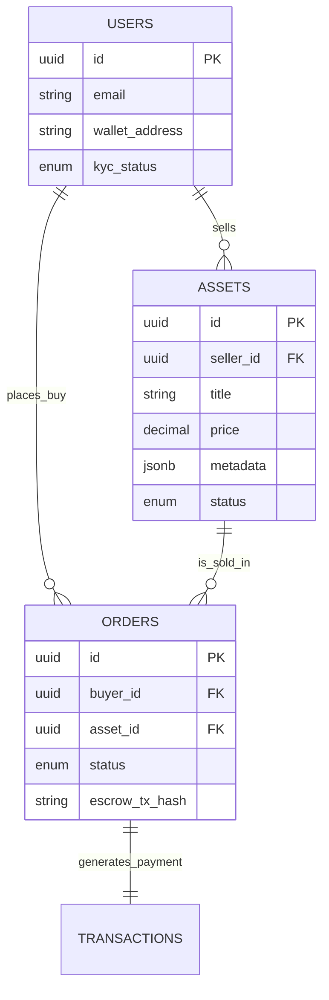

# 🗄️ Database Schema: UGDES POC

**Database Engine:** PostgreSQL 16+
**Rationale:** chosen for robust JSONB support (flexible metadata) and transactional integrity (Acid compliance for financial/escrow states).

## 1. ER Diagram Overview (Mermaid)



## 2. Table Definitions

### 2.1. `users`
Identity layer. In POC, we mock the VNeID verification but keep the field to simulate the flow.

```sql
CREATE TYPE kyc_status_enum AS ENUM ('NONE', 'PENDING', 'VERIFIED_VNEID');

CREATE TABLE users (
    id UUID PRIMARY KEY DEFAULT gen_random_uuid(),
    email VARCHAR(255) UNIQUE NOT NULL,
    password_hash VARCHAR(255) NOT NULL, -- Managed by Auth Service
    wallet_address VARCHAR(42), -- EVM Address for Escrow
    kyc_status kyc_status_enum DEFAULT 'NONE',
    full_name VARCHAR(100),
    created_at TIMESTAMP WITH TIME ZONE DEFAULT NOW(),
    updated_at TIMESTAMP WITH TIME ZONE DEFAULT NOW()
);
```

### 2.2. `assets`
The data products being traded.
*   **`proof_data`**: Stores sample links or validation proofs.
*   **`access_details`**: Encrypted info on how to access the real data (only revealed after payment).

```sql
CREATE TYPE asset_status_enum AS ENUM ('DRAFT', 'PENDING_AUDIT', 'PUBLISHED', 'SUSPENDED');

CREATE TABLE assets (
    id UUID PRIMARY KEY DEFAULT gen_random_uuid(),
    seller_id UUID NOT NULL REFERENCES users(id),
    
    -- Descriptive Info
    title VARCHAR(255) NOT NULL,
    description TEXT,
    
    -- Pricing & Legal
    price DECIMAL(18, 2) NOT NULL CHECK (price >= 0),
    currency VARCHAR(10) DEFAULT 'VND',
    license_type VARCHAR(50) DEFAULT 'STANDARD_USAGE',
    
    -- Technical Data
    metadata JSONB DEFAULT '{}', -- Flexible fields (Size, Format, Rows, Sensitivity Level)
    preview_url TEXT, -- Public sample
    
    -- The "Goods" (Protected)
    resource_url TEXT, -- Hidden, only for Delivery Service
    
    status asset_status_enum DEFAULT 'DRAFT',
    created_at TIMESTAMP WITH TIME ZONE DEFAULT NOW()
);
```

### 2.3. `orders`
Represents the trade lifecycle (The 12-Step Flow core).

```sql
-- The 12-step flow mapped to simple states
CREATE TYPE order_status_enum AS ENUM (
    'CREATED',          -- Step 5: Policy Agreed, Waiting for Payment
    'ESCROW_LOCKED',    -- Step 6: Money sent to Smart Contract
    'DELIVERING',       -- Step 8: System is generating access tokens
    'DELIVERED',        -- Step 9: Buyer received data
    'COMPLETED',        -- Step 11: Money released to Seller (Settled)
    'DISPUTED',         -- Dispute raised
    'CANCELLED'         -- Cancelled pre-escrow
);

CREATE TABLE orders (
    id UUID PRIMARY KEY DEFAULT gen_random_uuid(),
    buyer_id UUID NOT NULL REFERENCES users(id),
    asset_id UUID NOT NULL REFERENCES assets(id),
    
    -- Snapshot of price at time of order
    amount DECIMAL(18, 2) NOT NULL,
    currency VARCHAR(10) DEFAULT 'VND',
    
    -- Trust & Blockchain info
    escrow_smart_contract_address VARCHAR(42),
    escrow_tx_hash VARCHAR(66), -- Tx ID that locked the funds
    
    status order_status_enum DEFAULT 'CREATED',
    
    -- Timestamps for SLA tracking
    created_at TIMESTAMP WITH TIME ZONE DEFAULT NOW(),
    locked_at TIMESTAMP WITH TIME ZONE,
    delivered_at TIMESTAMP WITH TIME ZONE,
    completed_at TIMESTAMP WITH TIME ZONE
);
```

### 2.4. `audit_logs`
For Step 12 (Immutable Audit). In POC, we write here first, then push batch hash to Blockchain.

```sql
CREATE TABLE audit_logs (
    id UUID PRIMARY KEY DEFAULT gen_random_uuid(),
    actor_id UUID REFERENCES users(id),
    action VARCHAR(50) NOT NULL, -- e.g., 'LOGIN', 'VIEW_ASSET', 'DOWNLOAD_DATA'
    target_resource VARCHAR(50), -- e.g., 'orders:123'
    details JSONB,
    ip_address VARCHAR(45),
    created_at TIMESTAMP WITH TIME ZONE DEFAULT NOW()
);
```

## 3. Key Relationships & Constraints
1.  **Immutability:** Once an order is `COMPLETED`, it cannot go back to `CREATED`.
2.  **Data Integrity:** `price` in `orders` table is a copy of `assets.price` to prevent historical price changes from affecting past orders.
3.  **Audit Trail:** Every status change in `orders` should trigger an insert into `audit_logs`.
