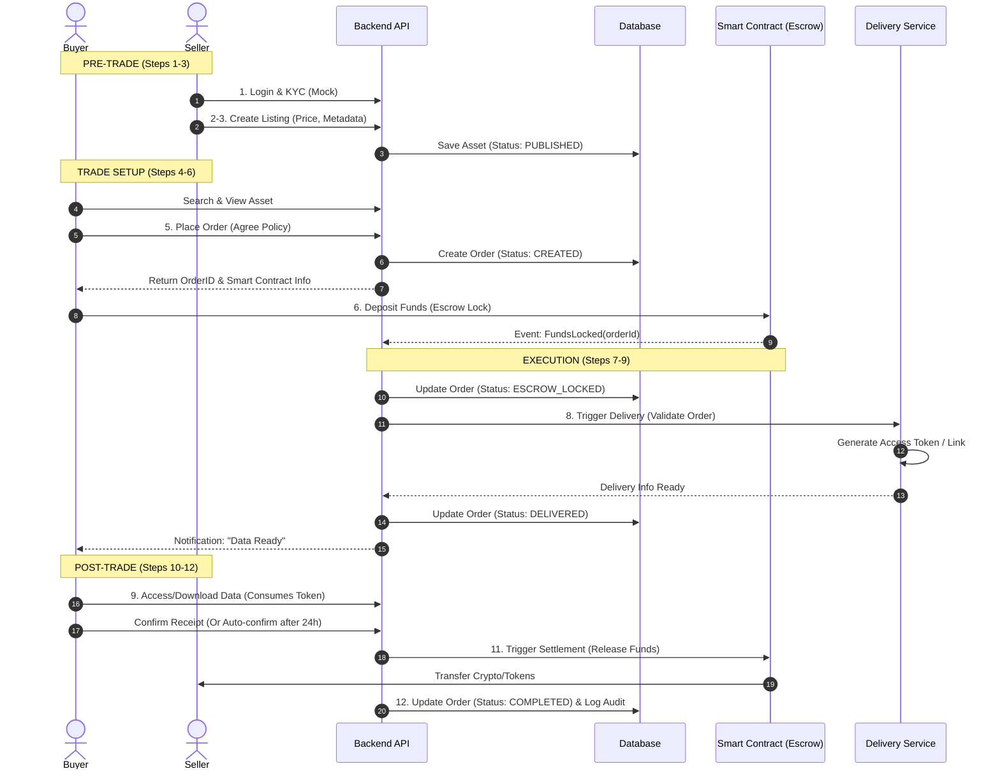

# 🏗️ System Architecture: UGDES POC

**Pattern:** Modular Monolith (for POC) -> Microservices (Target)
**Core Tech:** Node.js (Main Logic), Python (Data Processing), PostgreSQL (Data), EVM (Trust).

## 1. High-Level Architecture (The 4 Layers)

The system follows the 4-layer model defined in `BRIEF.md`:

```mermaid
graph TD
    subgraph Layer1_User["Layer 1: User & Interface"]
        WebApp["Web App (React/Vue)"]
        Wallet["Crypto Wallet (Metamask/Rabby)"]
    end

    subgraph Layer2_Catalog["Layer 2: Catalog & Business"]
        API["API Gateway (Express/NestJS)"]
        Auth["Identity Module (Mock VNeID)"]
        Catalog["Catalog Module (Listing/Search)"]
    end

    subgraph Layer3_Trust["Layer 3: Trust & Governance"]
        OrderManager["Order Matching Engine"]
        SmartContract["Escrow Smart Contract (EVM)"]
    end

    subgraph Layer4_Execution["Layer 4: Execution & Data"]
        Delivery["Secure Delivery Service"]
        MockTEE["Mock TEE (Docker Worker)"]
        DB[(PostgreSQL)]
    end

    WebApp --> API
    WebApp --> Wallet
    Wallet --> SmartContract
    API --> Auth
    API --> Catalog
    API --> OrderManager
    OrderManager --> SmartContract : Listen Events
    OrderManager --> Delivery : Trigger Release
    Delivery --> MockTEE : Execute Data
    Delivery --> DB : Read Encrypted URL
```

## 2. Component Responsibilities

### 2.1. Backend API (Node.js)
*   **Identity:** Manage Users, Mock KYC status.
*   **Catalog:** CRUD Assets, Search, Metadata handling.
*   **Trade:** Handle Order creation (`CREATED`), listen to Blockchain events to update status (`ESCROW_LOCKED`), and trigger delivery (`DELIVERING`).

### 2.2. Blockchain (Simulated or Local Hardhat)
*   **Escrow Contract:**
    *   `deposit(orderId)`: Buyer locks money. Status -> LOCKED.
    *   `release(orderId)`: Seller/System confirms delivery. Money -> Seller.
    *   `refund(orderId)`: Dispute resolved favor Buyer. Money -> Buyer.

### 2.3. Delivery Service (Python/Node)
*   Generates **Temporary Signed URLs** (AWS S3 Presigned or similar logic) for the buyer to download data.
*   Or runs a script in Docker (Mock TEE) if the asset type is "Compute-to-Data".

## 3. Sequence Diagram: The 12-Step Trade Flow

Mapping the UGDES 12-steps to technical interactions.



## 4. Key Design Decisions (Mock vs Real)
For POC Phase:
1.  **Blockchain Listener:** Instead of a complex Indexer (The Graph), we will use a simple **Polling/WebSocket** script in Node.js to listen for `FundsLocked` events from the local chain.
2.  **File Storage:** Use Local Filesystem or generic S3 for asset storage. `resource_url` in DB points to this.
